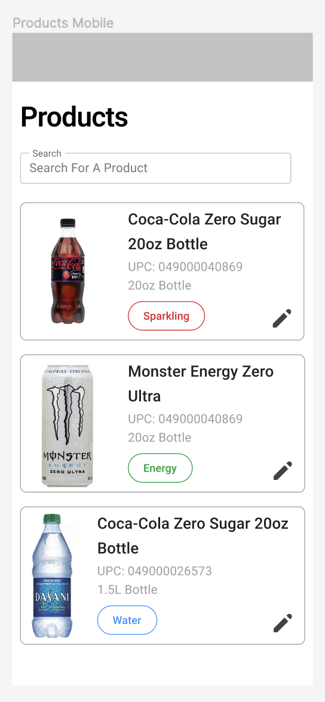

# Instructions

## Intro

The goal of this is to test your capabilities with the React framework as well as to evaluate some key development workflow processes common in the software development community. You will be making two pages with some simple features. You will use MaterialUI for all the base components you will need. If you have not used it, it is ok, we will provide some hints and you can use their documentation found here: https://mui.com/material-ui/getting-started/overview/ You will also be implementing one unit test.

We are excited for you to do this project and see what you make! Please let us know if you have any questions. This should take around an hour to complete.

## Steps

1. clone the repo
2. create a new branch
3. implement the following two pages
4. implement one test
5. create a merge request for your new branch

## Pages

### Page 1 /products

The purpose of this page is to search for a product, look at it's details and then edit them. Use the `constants/products.ts` file to initialize your list of products. The page should show the products like so:

#### Desktop

#### Mobile

The search will search on all properties of the products and filter the list down.

When you click on the edit button on the product tile, it will route you to the next page `/products/edit/<upc>`

### Page 2 /products/edit/<upc>

The purpose of this page is to edit the product details. Please make this page look like this:

#### Desktop

#### Mobile

After you make changes to the product, you can click save and update the product details. Clicking save will automatically route you back to the `/products` page and you should be able to view the same product you edited and see the changes. You can also click on the cancel button which will not save anything, but will route back to the `/products` page.

### Unit test

Please create a unit test to test something you think would be valuable to test.

### Notes

- There are no directories in this project. Please organize your code how you see fit.
- To look at the designs in figma go [here](https://www.figma.com/file/P9GmyoEWk2O7kGM6AuKB0o/Product-Page-Concept?node-id=0%3A1&t=ILoZZFrw14ajd3TF-1)
- You do not need to implement any functionality for the "Upload new product photo" button
- Please make sure it is responsive as seen in the designs
